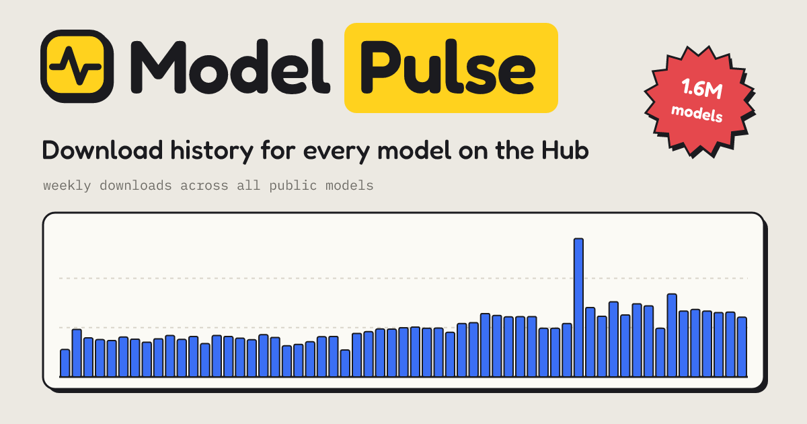

<p align="center">
  
</p>

# Model Pulse

**Daily download history for every model on the Hugging Face Hub**, back to July 2024.

A model page on the Hub tells you its downloads for the last 30 days, but not how it got there. Model Pulse rebuilds the day-by-day history for 1.6M models from the daily snapshots in [cfahlgren1/hub-stats](https://huggingface.co/datasets/cfahlgren1/hub-stats), and keeps it updated every day.

- **Site:** [modelpulse.ifsp.dev](https://modelpulse.ifsp.dev), also as a [Hugging Face Space](https://huggingface.co/spaces/tardellirs/model-pulse)
- **Open data:** [modelpulse/model-pulse-data](https://huggingface.co/datasets/modelpulse/model-pulse-data), one row per model per day
- **Report:** [What 19 months of daily downloads say about the Hub](https://modelpulse.ifsp.dev/report)

## What you can do with it

- **Look up any model**, e.g. [modelpulse.ifsp.dev/model/Qwen/Qwen3-8B](https://modelpulse.ifsp.dev/model/Qwen/Qwen3-8B): weekly, daily, 30-day and all-time downloads, likes, ranks and milestones
- **Compare** up to five models on one chart
- **See a model's family**: how much of its reach comes from its quantizations, fine-tunes, adapters and merges
- **Galaxy**: every model built on a base model, drawn as one picture
- **Wrapped**: any author's last 12 months on the Hub in six shareable cards
- **Rankings**: most downloaded, fastest growing, new breakouts, biggest families, top organizations
- **A badge for your model card**, refreshed daily:

  [](https://huggingface.co/spaces/tardellirs/model-pulse?model=Qwen/Qwen3-8B)

## How it works

1. **Backfill.** `pipeline/backfill_xet.py` reads every daily revision of `hub-stats` `models.parquet` and keeps four columns per model per day. `pipeline/build.py` turns them into monthly partitions, per-model metrics, family trees (via `base_model` links), author and Hub-wide series, and the leaderboards.
2. **Daily update.** `pipeline/daily.py` appends each new snapshot, recomputes the metrics and uploads the changed files to the dataset. It runs inside the API container, which checks for new data every hour.
3. **API and site.** `space/app` is a FastAPI + DuckDB service over the dataset (JSON API, badges, server-rendered pages, link previews and sitemaps). `space/web` is the Preact + uPlot frontend, served both on its own domain and as a static Hugging Face Space.

Download counts follow the [Hub's own counting rules](https://huggingface.co/docs/hub/models-download-stats). All-time totals start on 2025-02-27, when the Hub began reporting them; the rolling 30-day series goes back to 2024-07-29.

## Repository layout

| Path | What |
|---|---|
| `pipeline/` | Backfill, full build and daily incremental update of the dataset (polars) |
| `space/app/` | FastAPI + DuckDB API, badges, server-rendered pages (`seo.py`), link previews (`og.py`), background jobs |
| `space/web/` | Preact + Vite + uPlot frontend |
| `analysis/` | Notebook-style scripts and charts behind the report |
| `brand/` | Logo, thumbnail and organization card |

## Running it

```bash
# frontend, against the public API
cd space/web && npm install && VITE_API_BASE=https://modelpulse.ifsp.dev npm run dev

# API, with the dataset downloaded to ./data
cd space && pip install -r requirements.txt
DATA_DIR=../data DATA_REPO=modelpulse/model-pulse-data python -m app.serve
```

`space/deploy.sh` builds the frontend and runs the API container on a server behind Traefik (set `DEPLOY_HOST` in `space/.deploy.env`). `publish_site.sh` publishes the frontend to the Space.

## Credits

Made by **Tardelli Stekel** ([@tardellirs](https://huggingface.co/tardellirs), [stekel.ifsp.dev](https://stekel.ifsp.dev/)). Built on the daily snapshots collected by [@cfahlgren1](https://huggingface.co/cfahlgren1). An independent project, not affiliated with Hugging Face.

Licensed under the [Apache License 2.0](LICENSE).
