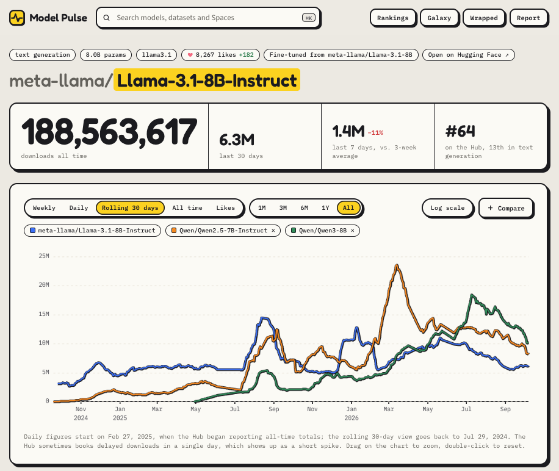
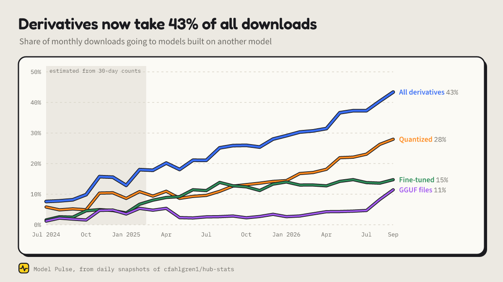
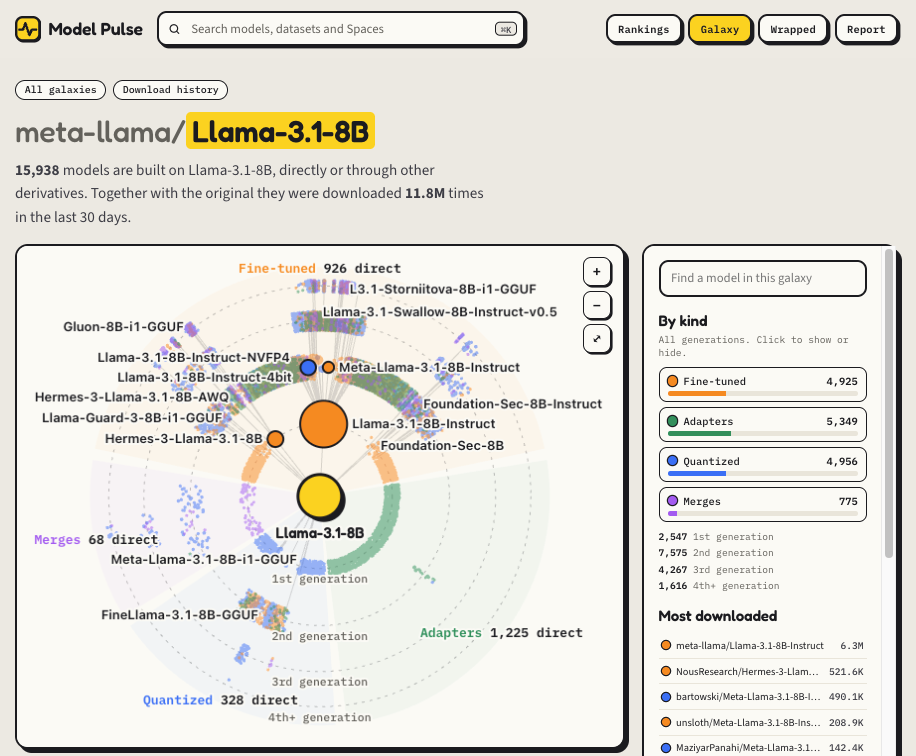
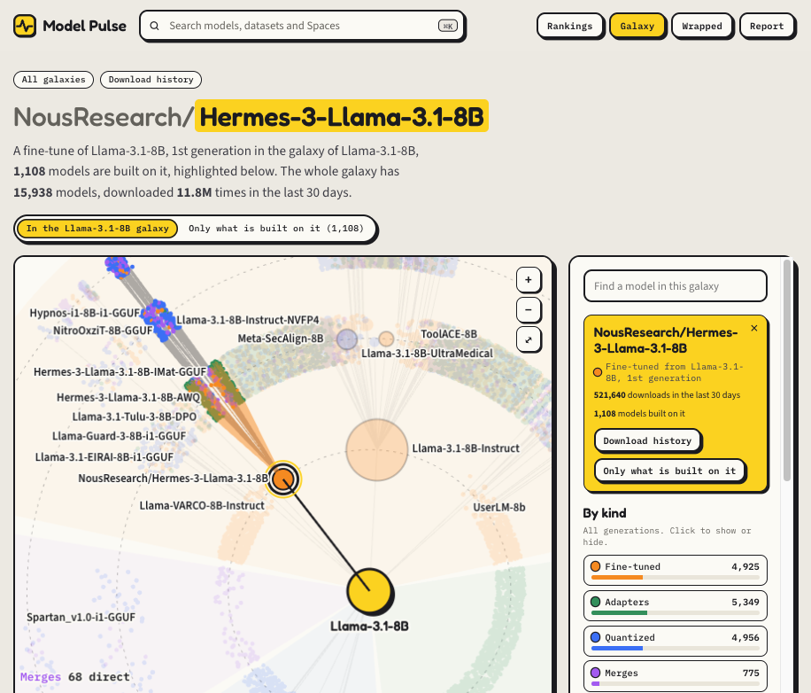
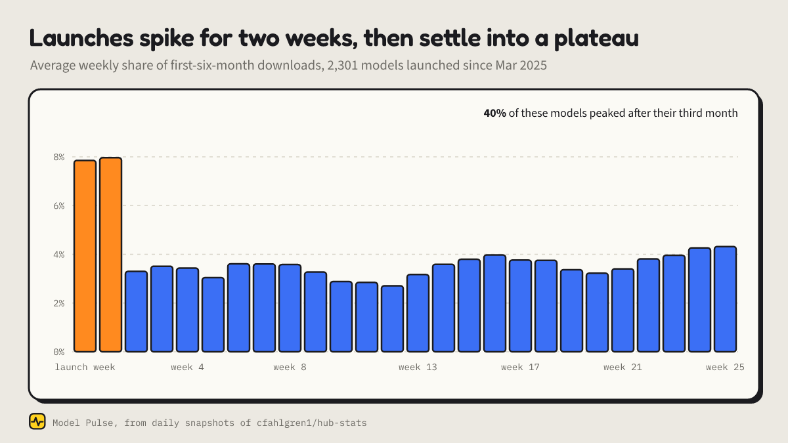
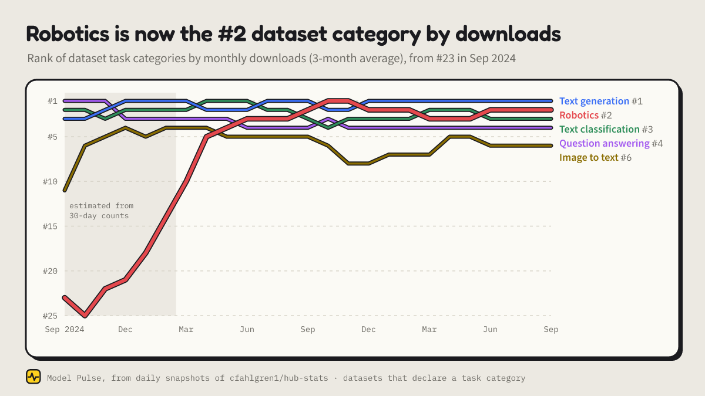
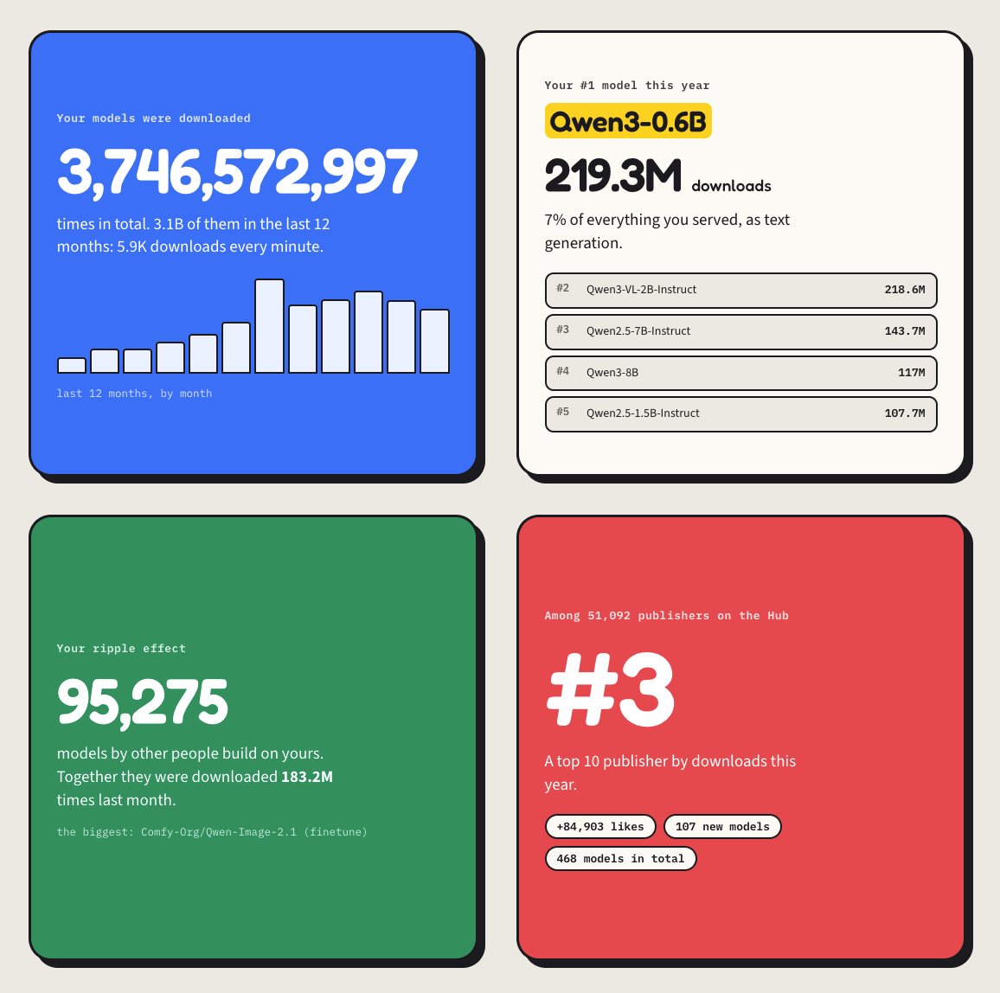

# Model Pulse: daily download history for every model on the Hugging Face Hub

Every model page on the Hub shows one number: downloads in the last 30 days. That number can't tell you whether a model is growing or fading, when it peaked, how it compares with its rivals, or how much of its reach comes from the quantizations and fine-tunes other people built on it.

[Model Pulse](https://huggingface.co/spaces/tardellirs/model-pulse) fills that gap. It rebuilds the day-by-day history of every model, dataset and Space on the Hub, back to July 2024, and publishes all of it as an [open dataset](https://huggingface.co/datasets/modelpulse/model-pulse-data).


*Rolling 30-day downloads since July 2024: Llama-3.1-8B-Instruct (blue) against Qwen2.5-7B-Instruct (orange) and Qwen3-8B (green). Straight stretches are gaps in the source data.*

## TL;DR

- **What it is:** daily download and like history for 1.62M models and 1.06M datasets, and like history for 104K Spaces, from 686 daily snapshots since 2024-07-29.
- **What you can do with it:**
  - chart any model daily, weekly or all-time, and compare up to five;
  - see every quantization, fine-tune, adapter and merge built on a model, drawn as a galaxy;
  - browse weekly rankings;
  - get a year in review for any author or organization.
- **Open data:** about 1.15 billion rows of Parquet under Apache 2.0, updated daily, and you can query it in place with DuckDB, Polars or 🤗 Datasets.
- **App:** [tardellirs/model-pulse](https://huggingface.co/spaces/tardellirs/model-pulse). **Data:** [modelpulse/model-pulse-data](https://huggingface.co/datasets/modelpulse/model-pulse-data). **Code:** [github.com/tardellirs/modelpulse](https://github.com/tardellirs/modelpulse).

## What a single number hides

Here are three things that only show up once you have the history. Each one comes from a feature of the app.

### 1. Nearly half of all downloads go to derivatives

In March 2025, 18% of the Hub's model downloads went to derivatives: models whose card declares a base model. In September 2026 it was 43%. Quantizations drove most of it, going from 9% to 28% of all downloads.



That changes how you should read a model's reach. 6,358 models build on [Qwen3-8B](https://huggingface.co/spaces/tardellirs/model-pulse?model=Qwen/Qwen3-8B), directly or through other derivatives. Together they take 39% of the family's 16.5M downloads in the last 30 days. If you only look at the original repo, you miss more than a third of its use.

On every model page, **Include derivatives** adds the whole family to the chart. **Galaxy** draws the family like a solar system: the base model in the center, one orbit per generation, one sector per kind of derivative, and planets sized by downloads.



The [Llama-3.1-8B galaxy](https://huggingface.co/spaces/tardellirs/model-pulse?model=meta-llama%2FLlama-3.1-8B&view=galaxy) holds 15,938 models. Open the galaxy of a fine-tune and it shows up inside its base model's galaxy, highlighted with everything built on it, so even a small fine-tune gets context. [Hermes 3](https://huggingface.co/spaces/tardellirs/model-pulse?model=NousResearch%2FHermes-3-Llama-3.1-8B&view=galaxy) is one of the 926 direct fine-tunes of Llama-3.1-8B, and 1,108 models build on it in turn: 544 quantizations, 287 merges, 221 adapters and 56 fine-tunes.



### 2. Launches don't fade, they plateau

I took the 2,301 models launched between March 2025 and March 2026 that passed 100K downloads in their first six months. On average, each of their first two weeks takes about 8% of the six months. After that, downloads settle at around 3% a week and stay there.

Only 10% of them had their best week at launch. The median best week is week 8, and 40% peaked after their third month. For a model that takes off, steady use matters more than the launch spike. A 30-day counter can't show that, but a daily series can.



### 3. Robotics is now the second most downloaded dataset category

Model Pulse tracks datasets the same way it tracks models. Robotics datasets got 13.7M downloads in September 2026, second only to text generation. In the fall of 2024 it ranked in the low 20s. One in seven new datasets is now robot data, mostly LeRobot recordings.



This one comes with caveats, which are in [What the numbers can't tell you](#what-the-numbers-cant-tell-you) below. Readers of the first announcement helped find them.

## A tour of the app

**Model pages.** These hold:
- downloads as daily, weekly, rolling 30-day or all-time figures, plus likes, over any range;
- milestones, such as the day a model crossed a million downloads;
- the family toggle, the Spaces that use the model, and a comparison of up to five models on one chart.

Authors can also add a live badge to their model card. It updates daily.

**Dataset and Space pages.** Datasets get the same charts, plus the models that list them as training data. 636 models list FineWeb. The Hub doesn't publish visits for Spaces, so Space pages follow likes instead.

**Rankings.** The weekly rankings for models are:
- most downloaded;
- fastest growing (this week against the three before);
- new this month;
- most liked;
- biggest families;
- top organizations.

Datasets and Spaces have their own. Models whose week came mostly from a single day are left out of the growth rankings, so one burst of CI downloads doesn't top the list.

**Galaxy.** Every derivative of a base model, drawn as an orrery. You can search inside a galaxy, hide kinds of derivatives, and download the picture.

**Wrapped.** A year in review for any author or organization. It shows:
- downloads in total and over the last 12 months;
- the biggest week;
- the most downloaded model;
- where you rank among the Hub's publishers;
- the "ripple effect": models other people built on yours, and how much they're downloaded.


*Four of the seven cards in [Qwen's Wrapped](https://huggingface.co/spaces/tardellirs/model-pulse?author=Qwen&view=wrapped). 95,275 models by other people build on Qwen's.*

**Report.** [What 19 months of daily downloads say about the Hub](https://modelpulse.ifsp.dev/report) covers more findings:
- the Hub serves about 103M model downloads a day, up from 61M a year earlier;
- Qwen's share of LLM downloads rose and then settled;
- the quantizers grew into some of the Hub's biggest publishers;
- likes measure excitement more than use.

## How it works

**Source.** [@cfahlgren1](https://huggingface.co/cfahlgren1)'s [hub-stats](https://huggingface.co/datasets/cfahlgren1/hub-stats) publishes a fresh snapshot of the Hub API almost every day. Model Pulse reads every historical revision of it and keeps, for each repo and day:
- the 30-day download count;
- the all-time download count;
- the likes.

**Daily downloads.** The all-time counter exists from 2025-02-27. From then on, a day's downloads are the difference between two snapshots, which makes them exact. Before that date only the rolling 30-day count exists, so the charts show that instead, and monthly figures are estimated from it.

**Which repos.** A model or dataset is tracked once it has 10+ downloads in 30 days, 50+ all-time downloads, or a like. That covers 1.62M of the Hub's models and nearly all of their downloads. A Space is tracked once it has a like.

**Cleaning.** The Hub's counters are noisy in a few known ways. The rules below make the daily series reliable without changing any totals:
- **Missing snapshots:** the days without a snapshot share the next one's average.
- **Partial snapshots** are set aside.
- **Stalls:** days when the counters stood still and caught up later, mostly on Wednesdays, are spread evenly over their days.
- **Rollbacks:** twice the all-time counters went backwards for many models and recovered days later. Downloads are measured across those episodes, so the recovery isn't counted twice.
- **Renames:** a renamed repo keeps its history under the new id.

The full rules are in the [dataset card](https://huggingface.co/datasets/modelpulse/model-pulse-data#methodology).

**Stack.** A daily pipeline rebuilds the data with DuckDB and uploads it to the dataset. A small FastAPI service answers the app. The app itself is a static Space built with Preact. The code is [on GitHub](https://github.com/tardellirs/modelpulse) under Apache 2.0.

## What the numbers can't tell you

**A download is not a user.** Downloads follow the Hub's [counting rules](https://huggingface.co/docs/hub/models-download-stats), so CI jobs, benchmarks and other automated pulls count too. That's why tiny test models rank surprisingly high.

**Dataset counting changed in the fall of 2024.** Before, only `load_dataset` calls counted. Now any file request does, with every request from one IP to one repo within five minutes merged into one download. In the snapshots the switch lands on 2024-10-22, when the 30-day counts were recomputed in one step.
- `hails/mmlu_no_train`, the MMLU copy that lm-evaluation-harness loads, fell from 28.7M to 163K overnight.
- Robotics nearly doubled, because LeRobot downloads that `load_dataset` never saw started to count.

Comparisons across that date mix two methods. That's why the robotics climb is measured from October 2024 on.

**Big repos count more often.** Under the five-minute rule, a long download can plausibly count more than once. And the largest datasets can't be counted as full copies: one 62 TB robotics dataset logged 363K downloads in 30 days. Across the Hub, datasets of a similar popularity get more downloads the bigger they are, and robotics is no exception.

What sets robotics apart is concentration. About half of its monthly downloads come from repos over 40 GB. Leave out every dataset of 4 GB or more and robotics still climbs, from 14th at the end of 2024 to 4th, but it stops at 4th. So "second" carries a size effect, while the rise itself doesn't depend on it.

**Gaps.** The source misses some days, most of June 2025 among them. Totals are unaffected, but daily values across a gap are averages.

## The open dataset

Everything behind the app is in [modelpulse/model-pulse-data](https://huggingface.co/datasets/modelpulse/model-pulse-data), as plain Parquet. It holds:
- daily series per model, dataset, Space, family and author;
- the latest metadata and rankings;
- the base → derivative edges;
- the links from Spaces and models to the repos they use.

The daily series are split into monthly files, so you can read only the months you need.

```sql
-- DuckDB: daily downloads of one model, straight from the Hub
SELECT day, dl30, dl_all - lag(dl_all) OVER (ORDER BY day) AS downloads
FROM 'hf://datasets/modelpulse/model-pulse-data/series/*.parquet'
WHERE id = 'Qwen/Qwen3-8B'
ORDER BY day;
```

```python
from datasets import load_dataset

hub = load_dataset("modelpulse/model-pulse-data", "hub_series", split="train")  # Hub-wide downloads per day and task
```

It is updated daily and licensed Apache 2.0, like its source.

## Try it, and tell me what's wrong

- **Look up a model, dataset or author:** [huggingface.co/spaces/tardellirs/model-pulse](https://huggingface.co/spaces/tardellirs/model-pulse).
- **Corrections and ideas:** the Space and the dataset have Community tabs. Several fixes already came from readers. Thanks to [@dipankarsarkar](https://huggingface.co/dipankarsarkar), whose questions under the launch posts fixed three data issues and led to the size analysis above.
- **If it's useful, a like helps.** The Hub lists the most-liked Spaces on each model page, so a like keeps download history one click away for everyone.

Thanks to [@cfahlgren1](https://huggingface.co/cfahlgren1) for hub-stats, without which none of this would exist. If you follow papers more than models, the sister project [Paper Pulse](https://huggingface.co/spaces/tardellirs/paper-pulse) does the same for Daily Papers upvotes.

```bibtex
@misc{stekel2026modelpulse,
  author       = {Stekel, Tardelli},
  title        = {Model Pulse: Daily History of Hugging Face Models, Datasets and Spaces},
  year         = {2026},
  publisher    = {Hugging Face},
  howpublished = {\url{https://huggingface.co/datasets/modelpulse/model-pulse-data}}
}
```

*Model Pulse is an independent project and is not affiliated with Hugging Face.*
